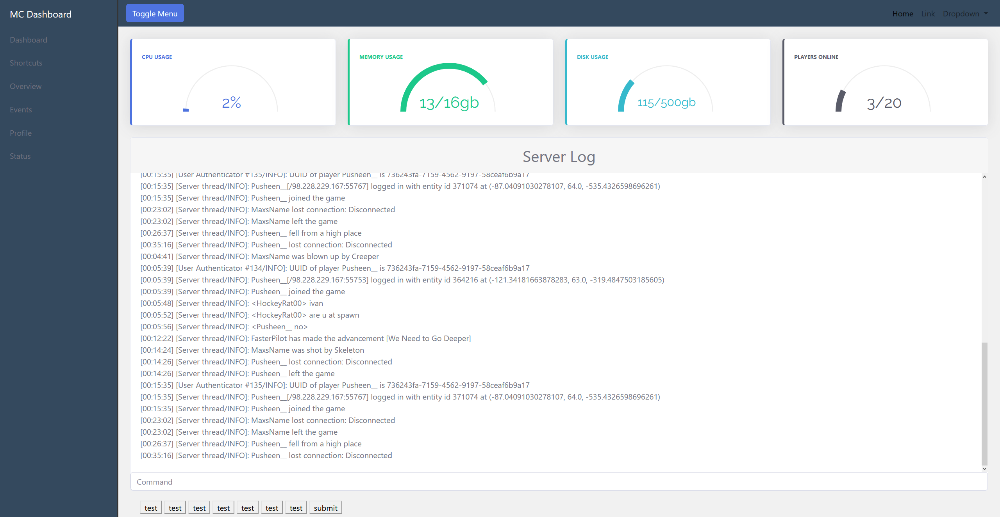

# MC Dashboard [Work In Progress]
A custom made dashboard for my minecraft server

# Todo
* Front End
  * Create authentication system
  * Create interface for console commands
* Back End
  * Add a way to access system usage
  * Add access to docker
  * Test for possible security issues

# Sources
https://github.com/thodorisbais/percircle

https://codeconvey.com/css-percentage-circle/

https://kimmobrunfeldt.github.io/progressbar.js/

https://bbbootstrap.com/snippets/chartjs-line-chart-72287923

https://bootsnipp.com/snippets/nrDmZ

https://www.jqueryscript.net/other/Highly-Customizable-jQuery-Toast-Message-Plugin-Toastr.html
